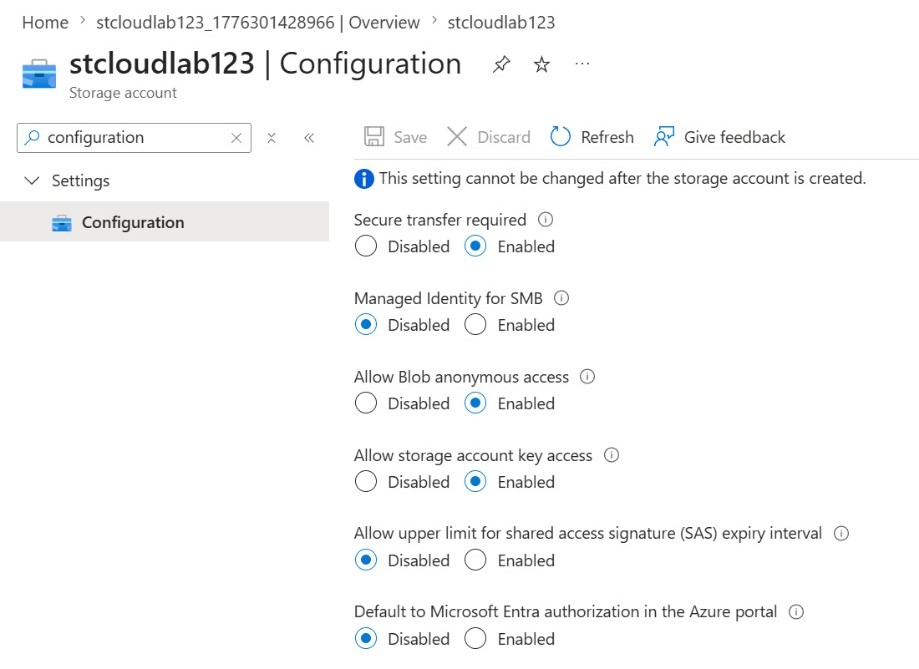
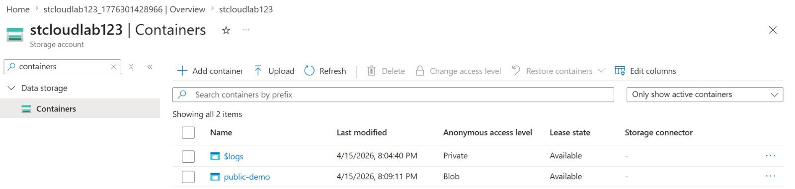
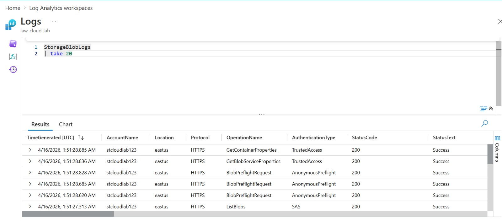
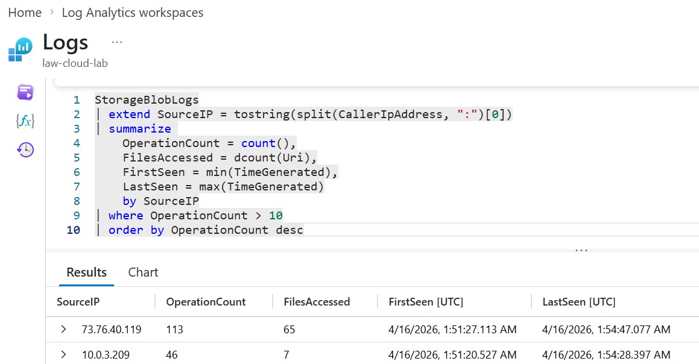
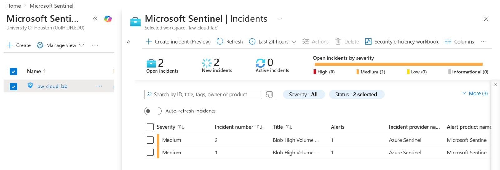

# 🛡️ Cloud Misconfiguration Detection Lab (Azure + Microsoft Sentinel)

## 📌 Overview

This project demonstrates an end-to-end cloud security workflow by simulating a misconfiguration in Azure, exploiting it, collecting logs, detecting suspicious activity, and triggering alerts using Microsoft Sentinel.

---

## 🎯 Objective

To detect unauthorized high-volume access to Azure Blob Storage caused by a misconfiguration allowing anonymous access.

---

## ⚠️ Misconfiguration

- Enabled anonymous access on Azure Storage
- Created publicly accessible blob container



---

## 🕵️ Attack Simulation

- Accessed blob files from external system
- Performed repeated downloads and enumeration



---

## 📊 Log Collection

- Logs collected using Azure Monitor
- Data available in `StorageBlobLogs`



---

## 🔍 Detection Logic



KQL query used to detect suspicious behavior:

```kusto
StorageBlobLogs
| extend SourceIP = tostring(split(CallerIpAddress, ":")[0])
| summarize 
    OperationCount = count(),
    FilesAccessed = dcount(Uri)
    by SourceIP
| where OperationCount > 10
```

## 🚨 **Alerting**

Microsoft Sentinel analytics rule triggered an alert based on detection logic identifying suspicious high-volume blob access.

---

## 🕵️ **Incident Investigation**

- Identified source IP address  
- Analyzed access patterns  
- Confirmed high-volume activity within a short time window  



---

## 🧠 **MITRE ATT&CK Mapping**

- **Collection**  
- **Exfiltration**

---

## 🏆 **Outcome**

Successfully demonstrated:

**Misconfiguration → Exploitation → Detection → Alert → Investigation**

---

## ⚙️ **Technologies Used**

- Microsoft Azure  
- Microsoft Sentinel  
- Azure Monitor  
- KQL (Kusto Query Language)  
